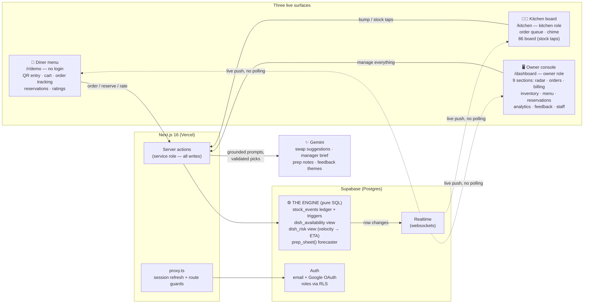
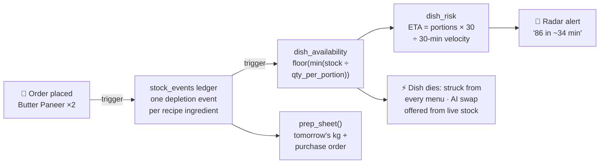

<div align="center">

# 🍽️ Eighty~~Six~~ — see the 86 coming

### The Restaurant Operating System Built Around One Idea: **The Menu Should Never Lie**

**Predictive Stockouts · Recipe-Graph Availability · Three Live Surfaces · Computed Interventions · AI With Guardrails**

<br />

[](https://nextjs.org/)
[](https://react.dev/)
[](https://www.typescriptlang.org/)
[](https://supabase.com/)
[](https://tailwindcss.com/)

[](https://ai.google.dev/)
[](https://eightysix-two.vercel.app)
[](LICENSE)

<br />

> A single engine — **ingredients → recipes → dishes** — computes true availability for every dish, **predicts** which dish dies next from live order velocity, and **acts** before diners hit a dead end. Where existing tools offer manual on/off toggles, EightySix forecasts the stockout and intervenes on every screen at once.

**🚀 Live demo → [eightysix-two.vercel.app](https://eightysix-two.vercel.app)** · no setup, resets itself

<p align="center">
  <a href="#%EF%B8%8F-judge-mode-2-minutes">Judge Mode</a> •
  <a href="#-screenshots">Screenshots</a> •
  <a href="#%EF%B8%8F-architecture">Architecture</a> •
  <a href="#-key-features">Features</a> •
  <a href="#-documentation">Docs</a> •
  <a href="#-running-locally">Setup</a>
</p>

</div>

---

## 🎯 The Problem

When an ingredient dies mid-service, the kitchen finds out first, waiters find out from angry cooks, and diners find out *after ordering*. Online menus stay stale for hours. Nothing on the market predicts the stockout — everything reports it after the damage is done.

**How EightySix solves it:**

| Legacy tools | EightySix |
|---|---|
| Manual "sold out" toggles a human must remember to flip | Availability **derived** from live stock through the recipe graph |
| Stockout discovered when a diner orders a dead dish | Stockout **predicted** — every dish gets a live time-of-death |
| Each screen polls its own stale copy of the menu | One row change fans out to diner, kitchen and owner **in the same second** |
| Dashboards that report the damage | One-tap **interventions** computed from the recipe graph |

## 🏷️ Why "EightySix"?

**"86"** is real kitchen slang: when a dish runs out, it gets *86'd* — struck off the menu. The product is named after the exact moment it exists to prevent, and the brand mark is the strikethrough itself: Eighty~~Six~~.

## 💡 What Makes It Unique

- **Predictive 86ing** — every dish gets a live *time of death*: `portions_left ÷ order velocity`. The manager is warned while there's still time to act.
- **A recipe graph, not a toggle** — availability is *derived*: a dish is as available as its scarcest ingredient. Edit a recipe quantity and portions-left recomputes everywhere, live.
- **Three surfaces, one truth** — diner menu, kitchen board, and owner console react to the same row change in the same second. No polling anywhere.
- **Interventions are computed, not suggested** — one tap on a dying dish restocks the exact quantity the recipe graph says covers the next two hours; the service planner answers "150 diners tonight?" with arithmetic, not a confidence score.
- **AI with guardrails** — Gemini suggests swaps and writes briefs, but only from engine data; its picks are validated against live stock before display.
- **A demo that proves it** — the Dinner Rush floods the system through the *real* order path, so judges watch the whole machine react, live.

## ⏱️ Judge Mode (2 Minutes)

1. **Open** the [live demo](https://eightysix-two.vercel.app) → **Open the owner console** (one-click login).
2. **Second tab:** the diner menu at [`/r/demo`](https://eightysix-two.vercel.app/r/demo) — no login, like scanning a table QR.
3. **Press "Simulate dinner rush."** Watch, in order: kitchen fills (with sound) → menu badges count down → status banner flips green → amber → red → the **86-risk radar** predicts each dish's death → a dish dies and is struck through on the diner menu *in the same second*.
4. **Press "Prep"** on a dying radar row — the engine computes the exact restock (e.g. *"+0.5 kg urad dal — covers ~2h at current pace"*) and executes it. Or try **"Plan a service"** to see what 150 diners would do to tonight's stock.
5. **Tap the dead dish** on the menu → the AI names the ingredient that ran out and offers the closest available swap.
6. **Reset demo** restores the seed state anytime.

### 🔑 Demo Credentials

| Portal Role | Email | Password | Access URL |
|---|---|---|---|
| **Owner Console** | `owner@eightysix.demo` | `eightysix-owner-demo` | `/dashboard` |
| **Kitchen Board** | `kitchen@eightysix.demo` | `eightysix-kitchen-demo` | `/kitchen` |
| **Diner Menu** | *no login — public QR entry* | — | `/r/demo` |

*(All behind one-click buttons on the login page — you never have to type these.)*

## 📸 Screenshots

| Landing | Owner Console — 86-Risk Radar |
| :---: | :---: |
|  |  |

| Kitchen Board | Orders → GST Billing |
| :---: | :---: |
|  |  |

| Menu CRUD + Live Recipe Editor | 7-Day Analytics + CSV Export |
| :---: | :---: |
|  |  |

<div align="center">

| Diner Menu (Mobile — QR Entry) |
| :---: |
|  |

</div>

## 🏗️ Architecture



### How a single order changes everything



📖 Deep dive — request lifecycle, realtime fan-out, design decisions: **[docs/ARCHITECTURE.md](docs/ARCHITECTURE.md)**

## ⚙️ Core Engine Components

| Component | What it does |
|---|---|
| `stock_events` | Event-sourced inventory ledger — every stock change is an auditable row |
| Triggers | Order items auto-deplete every recipe ingredient; events fold into live stock |
| `dish_availability` | `floor(min(stock ÷ qty_per_portion))` — scarcest ingredient wins |
| `dish_risk` | Trailing 30-min velocity → `minutes_to_86` per dish |
| `prep_sheet()` | Day-of-week usage history → tomorrow's per-station kg + draft purchase order |
| Realtime + RLS | Row changes push to every screen; public reads, role-scoped writes |

Every number on screen derives from these rows — no mock data, no hardcoded countdowns. The math is verified against hand-computed values (Butter Paneer ×2 ordered → paneer 9 kg → 8.6 kg → 45 → 43 portions → at 6 portions/30 min velocity, 86 in exactly 215 min).

📖 Full schema, every trigger and view, RLS policies: **[docs/ARCHITECTURE.md](docs/ARCHITECTURE.md)**

## ✨ Key Features

### 🔮 Prediction Engine
Live per-dish availability · 86-risk radar with time-of-death · 45-min alerts · one-tap radar interventions (restock quantity *computed* from the recipe graph to cover ~2h at current pace) · **service planner**: a deterministic what-if — "150 diners tonight?" → exactly which dishes die at which cover, a priced buy list, projected vs lost revenue · restaurant status banner · prep-sheet forecaster + purchase order

### 🏪 Restaurant Operations
QR table entry · cart + live order tracking · kitchen queue with chime + one-tap stock board · orders board → GST billing · ledger-audited inventory · menu CRUD with live recipe editor · reservations (book → seat → complete) · tables · staff accounts · 7-day analytics with CSV export

### 🤖 AI Features
Dead-dish swap suggestions (with the real cause: *"kitchen ran out of paneer"*) · manager brief · chef's prep notes · feedback theme summaries

### 🎬 Demo Experience
One-click role entry · Simulate Dinner Rush · self-resetting seed restaurant · diner ratings · printable QRs, receipts and prep sheets

📖 Every feature, every route, all 19 server actions: **[docs/FEATURES.md](docs/FEATURES.md)**

## 🏆 User Stories Completed

| Tier | Delivered |
|---|---|
| 🥉 Bronze | Product landing with animated dashboard mock · 9-section owner console |
| 🥈 Silver | Email verification + Google OAuth + RLS roles · live digital menu with **real availability** · order lifecycle · realtime notifications |
| 🥇 Gold | Orders, tables, inventory, sales and analytics — all live views of one engine |
| 💎 Platinum | Predictive 86ing · risk radar · AI swaps + briefs · prep-sheet + purchase-order generation |
| ⭐ Bonus | **Simulate Dinner Rush** — the whole system visibly reacts across three screens |

📖 Story-by-story mapping with implementation notes: **[docs/FEATURES.md](docs/FEATURES.md)**

## 🛠️ Technology Stack

| Domain | Technology | Usage & Scope |
| :--- | :--- | :--- |
| **Core Framework** | **Next.js 16.2 (App Router)** | Server components, server actions for every write, Turbopack dev |
| **UI Runtime** | **React 19** | Client islands only where interactivity demands it |
| **Language** | **TypeScript 5** | End-to-end typed — engine rows to UI props |
| **Styling** | **Tailwind CSS v4 + shadcn/ui (Radix)** | Design system, dark aesthetics, `motion` micro-animations |
| **Database + Realtime** | **Supabase (Postgres)** | The engine itself: views, triggers, functions · websocket row-change push |
| **Auth** | **Supabase Auth** | Email verification + Google OAuth · roles enforced by RLS |
| **AI** | **Google Gemini (`gemini-flash-latest`)** | Grounded prompts over engine data, JSON mode, validated output |
| **Deployment** | **Vercel** | Production deployment + preview builds |

## 📁 Directory Structure

```text
eightysix/
├── src/
│   ├── app/
│   │   ├── (auth)/                # Login + signup with one-click demo entry
│   │   ├── auth/callback/         # OAuth + email-link redirect handler
│   │   ├── r/[slug]/              # 📱 Diner menu — public, QR entry, cart, tracking
│   │   ├── kitchen/               # 👨‍🍳 Kitchen board — order queue + 86 stock board
│   │   ├── dashboard/             # 🖥️ Owner console (9 sections)
│   │   │   ├── analytics/         #   7-day analytics + CSV export
│   │   │   ├── bill/[orderId]/    #   GST billing + printable receipt
│   │   │   ├── feedback/          #   Diner ratings + AI theme summary
│   │   │   ├── inventory/         #   Ledger-audited stock management
│   │   │   ├── menu/              #   Menu CRUD + live recipe editor
│   │   │   ├── orders/            #   Orders board → billing
│   │   │   ├── prep/              #   Prep-sheet forecaster + purchase order
│   │   │   ├── qr/                #   Printable table QR codes
│   │   │   ├── reservations/      #   Book → seat → complete lifecycle
│   │   │   ├── staff/             #   Staff account management
│   │   │   └── tables/            #   Floor & table status
│   │   ├── actions.ts             # ALL writes — 19 server actions (service role)
│   │   └── page.tsx               # Product landing with animated dashboard mock
│   ├── components/                # Brand, sidebar, rush controls, shadcn/ui kit
│   ├── lib/
│   │   ├── engine.ts              # Typed client of the SQL engine — risk, health, analytics
│   │   ├── gemini.ts              # Gemini REST wrapper (text + strict JSON mode)
│   │   ├── owner.ts               # Per-request auth context for the console
│   │   ├── demo.ts                # One-click evaluator accounts
│   │   └── supabase/              # Browser / server / admin (service-role) clients
│   └── proxy.ts                   # Session refresh + route guards
├── supabase/migrations/           # ⚙️ THE ENGINE — 001 → 005, pure SQL
├── screenshots/                   # README screenshots
├── docs/                          # 📚 Deep-dive documentation
└── PRD.md                         # Product requirements document
```

## 📚 Documentation

| Document | What's Inside |
| :--- | :--- |
| **[docs/ARCHITECTURE.md](docs/ARCHITECTURE.md)** | The deep dive — system design, full database engine (schema, triggers, views, RLS), security model, AI guardrails, design decisions |
| **[docs/FEATURES.md](docs/FEATURES.md)** | Every feature by surface, complete route map, all 19 server actions, user-story tier mapping |
| **[docs/SETUP.md](docs/SETUP.md)** | Local install, Supabase provisioning, env vars, Vercel deployment, troubleshooting |

## 🔩 Engineering Highlights

- **Event-sourced inventory** — stock is never edited in place; a ledger + trigger folds events into state, so the overview shows a live audit trail.
- **SQL-first engine** — availability, velocity and forecasting live in Postgres views/functions; the UI can't disagree with the database.
- **Zero polling** — every screen subscribes to Supabase Realtime; one row change fans out to three surfaces.
- **Writes behind server actions** — anon clients are read-only by RLS; every mutation crosses the server with the service role.
- **Server-trusted money** — prices, totals and GST always come from database rows on the server; nothing financial is accepted from the client.
- **Defense in depth** — role-guarded routing (`proxy.ts`) + per-request auth checks + row-level security at the database, with orders re-validated against live availability at placement time.
- **Deterministic status** — the red/amber/green banner is computed from the radar, never generated.

## 🧗 Technical Challenges Solved

- **One order, ten reactions** — a single insert must correctly cascade through the ledger, stock, availability, predictions, kitchen queue, diner badges, analytics and prep forecast — in real time, on three screens. Getting that graph right (and provably right) was the core of the build.
- **Predicting from a sliding window** — velocity decays with time, not just events, so risk recomputes on both realtime triggers and a clock tick.
- **Demo integrity** — the rush simulator uses the identical code path as real orders; a stable-ID reset restores the seed without breaking logins, realtime channels, or QR links.
- **Prod-parity details** — UTC server rendering vs IST clients (hydration-safe timestamps), OAuth + email-link redirects across environments, RLS that stays strict while diners stay anonymous.

## 🤖 AI With Guardrails

AI never invents data here — **SQL is always the source of truth.** Gemini is prompted only with engine output (live availability, real ratings, real usage history), its swap picks are validated against current stock before display, and every AI feature has a non-AI fallback. In development: built with AI-assisted coding (Claude Code), with every feature verified against the live database via scripted end-to-end checks.

📖 Prompt-grounding and validation details: **[docs/ARCHITECTURE.md](docs/ARCHITECTURE.md#ai-with-guardrails)**

> Dish photography sourced from [Wikimedia Commons](https://commons.wikimedia.org) (Creative Commons licenses).

## 🚀 Running Locally

**Prerequisites:** Node.js 18+, a [Supabase](https://supabase.com) project, a [Gemini API key](https://aistudio.google.com/apikey) (free tier fine)

```bash
# 1. Clone the repo
git clone https://github.com/uttampreet-dev/EightySix.git
cd EightySix

# 2. Install dependencies
npm install

# 3. Configure environment
cp .env.example .env.local   # Supabase URL, anon key, service-role key, Gemini key

# 4. Start the dev server
npm run dev
```

Run `supabase/migrations/` **001 → 005** in the Supabase SQL editor, in order. `001` creates the schema, engine and demo seed; `005` adds reservations + feedback.

📖 Step-by-step provisioning + Vercel deployment: **[docs/SETUP.md](docs/SETUP.md)**

## 📄 License

This project is licensed under the **MIT License** — see [LICENSE](LICENSE).

---

<div align="center">

*Next.js 16 · Tailwind v4 + shadcn/ui · Supabase · Gemini · Vercel*

**One engine, three surfaces, a menu that can't lie.**

⭐ **If EightySix caught the 86 before you did, star the repo!** ⭐

</div>
