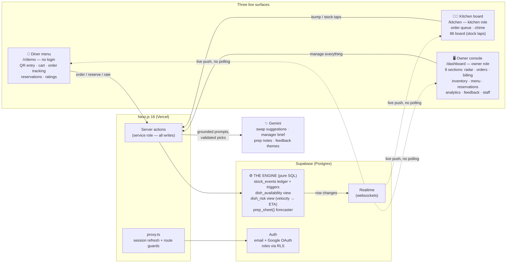
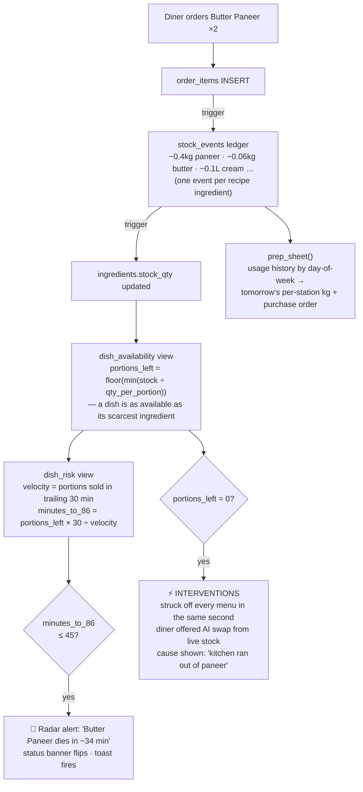

# EightySix — see the 86 coming

> **"86"** *(kitchen slang)*: when a dish runs out and gets struck off the menu.

**EightySix is a restaurant operating system built around one idea: the menu should never lie.** One engine — ingredients → recipes → dishes — computes true availability for every dish, **predicts** which dish dies next from live order velocity, and **acts** before diners hit a dead end: scarcity badges, instant strikethroughs on every screen, and AI-suggested swaps grounded in what's actually still in the kitchen.

**Live demo: https://eightysix-two.vercel.app** — no setup needed. Built solo by **Uttampreet** for Vibeathon 6.0 (PS: Smart Restaurant Management System).

## The 60-second tour

1. Open the **live demo** → press **Open the owner console** (one-click demo login).
2. In a second tab, open the **diner menu** (`/r/demo`) — no login, like scanning a table QR.
3. In the console, press **Simulate dinner rush**. For 90 seconds, synthetic orders flow through the *same* tables and triggers as real ones — watch badges count down on the diner menu, the kitchen queue fill (with sound), the status banner flip green → amber → red, and the **86-risk radar** predict each dish's time of death. When a dish dies, tap it on the diner menu → the AI names the ingredient that ran out and offers the closest available swap.
4. Press **Reset demo** anytime to restore the seed state.

Demo credentials (also behind the one-click buttons): `owner@eightysix.demo` / `eightysix-owner-demo` · `kitchen@eightysix.demo` / `eightysix-kitchen-demo`

## Architecture



### The engine — how a single order changes everything



Every number on every screen derives from these live rows. There are no mock data files, no hardcoded countdowns, no pre-rendered charts — the availability math was verified against hand-computed values (e.g. 6 portions ordered → paneer 9 kg → 8.6 kg → 45 → 43 portions, velocity 6/30min → 86 in exactly 300 min).

## User stories

| Tier | Requirement | Where |
|---|---|---|
| 🥉 Bronze | Attractive landing + dashboard UI | Product landing with animated dashboard mock · 9-section owner console |
| 🥈 Silver | Secure auth (OTP + Google) · digital menu · **live item availability** · order management · notifications | Email verification + Google OAuth + roles (RLS-scoped) · live diner menu with per-dish portions · order lifecycle placed→cooking→served→paid · realtime toasts + kitchen chime |
| 🥇 Gold | Orders, tables, inventory, sales, analytics dashboards | Orders board with GST billing · tap-to-toggle tables · ledger-audited inventory · 7-day analytics (revenue, categories, peak hours, top dishes) |
| 💎 Platinum | Advanced intelligence | **Predictive 86ing** (time-of-death per dish) · 86-risk radar with alerts · AI swap suggestions · prep-sheet forecaster + draft purchase order · AI manager brief |
| ⭐ Bonus | The wow | **Simulate Dinner Rush** — the whole system visibly reacts in real time, across three screens at once |

Beyond the tiers: table QR codes (scan → menu with table pre-selected), diner order tracking, reservations (diner booking → seat → complete), diner ratings with AI theme summaries, staff account management, recipe editor where **editing a quantity recomputes availability everywhere, live**, printable prep sheets and GST receipts, and a self-resetting demo.

## Tech stack

**Next.js 16** (App Router, TypeScript, Turbopack) · **Tailwind v4 + shadcn/ui** · **Supabase** (Postgres, Auth, Realtime, RLS) · **Gemini API** · **Vercel** · motion · qrcode

## AI usage

- **In the product (Gemini):** swap suggestions when a dish dies (prompted only with currently-available dishes, picks validated against live stock before display — with a non-AI fallback), the manager brief, prep-sheet chef notes, and feedback theme summaries. AI narrates and recommends; it never invents numbers — every figure it sees comes from the engine.
- **In development:** built with AI-assisted coding (Claude Code) — architecture, SQL, and every feature verified against the live database with scripted end-to-end checks.

## Running locally

```bash
npm install
cp .env.example .env.local   # fill in Supabase URL, anon key, service-role key, Gemini key
npm run dev
```

Database setup: run the files in `supabase/migrations/` (001 → 005) in the Supabase SQL editor, in order. `001` creates the schema, engine triggers and seeds the demo restaurant; `005` adds reservations + feedback. Roles: sign-ups get a profile via trigger (owner by default); the demo accounts above are pre-seeded.
