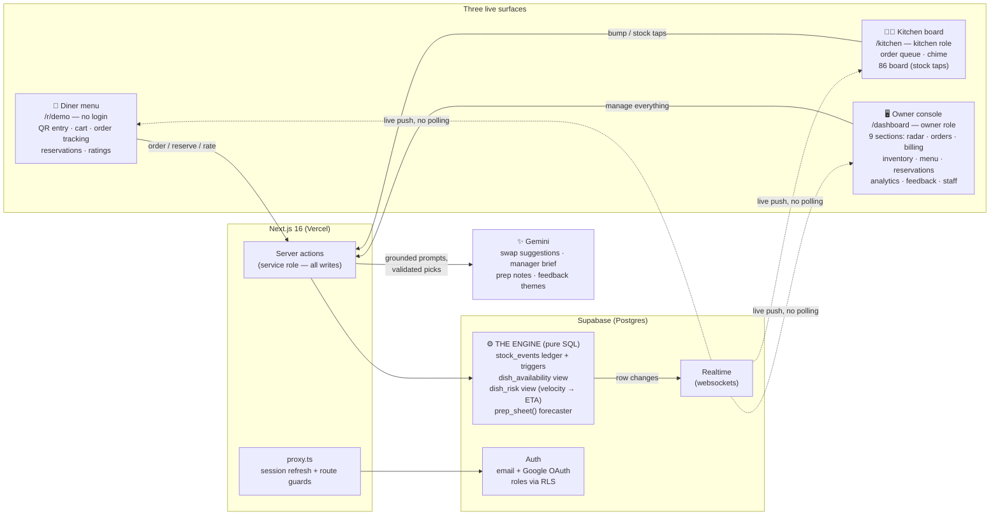
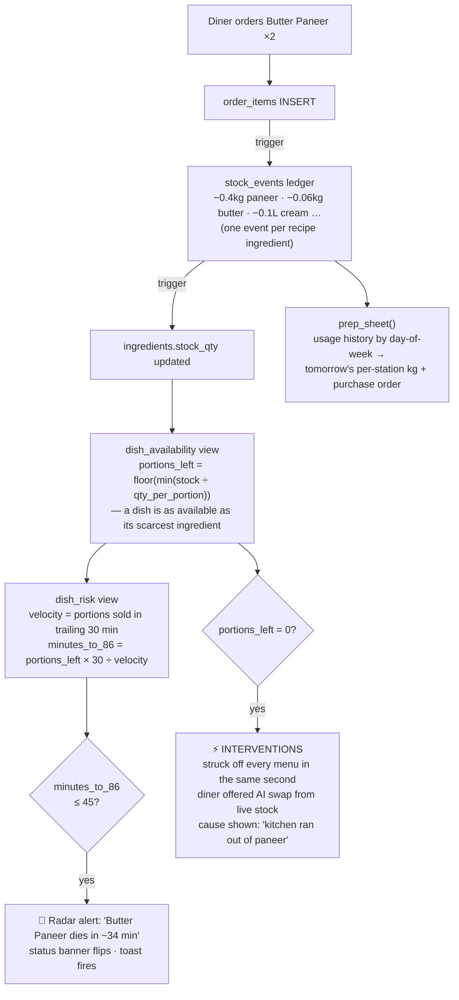

# EightySix — see the 86 coming

**EightySix is a restaurant operating system built around one idea: the menu should never lie.**

A single engine — ingredients → recipes → dishes — computes true availability for every dish, **predicts** which dish dies next from live order velocity, and **acts** before diners hit a dead end. Where existing tools offer manual on/off toggles, EightySix forecasts the stockout and intervenes on every screen at once.

**Live demo → https://eightysix-two.vercel.app** · no setup, resets itself

## The problem

When an ingredient dies mid-service, the kitchen finds out first, waiters find out from angry cooks, and diners find out *after ordering*. Online menus stay stale for hours. Nothing on the market predicts the stockout — everything reports it after the damage is done.

## Why "EightySix"?

**"86"** is real kitchen slang: when a dish runs out, it gets *86'd* — struck off the menu. The product is named after the exact moment it exists to prevent, and the brand mark is the strikethrough itself: Eighty~~Six~~.

## What makes it unique

- **Predictive 86ing** — every dish gets a live *time of death*: `portions_left ÷ order velocity`. The manager is warned while there's still time to act.
- **A recipe graph, not a toggle** — availability is *derived*: a dish is as available as its scarcest ingredient. Edit a recipe quantity and portions-left recomputes everywhere, live.
- **Three surfaces, one truth** — diner menu, kitchen board, and owner console react to the same row change in the same second. No polling anywhere.
- **AI with guardrails** — Gemini suggests swaps and writes briefs, but only from engine data; its picks are validated against live stock before display.
- **A demo that proves it** — the Dinner Rush floods the system through the *real* order path, so judges watch the whole machine react, live.

## Judge mode (2 minutes)

1. **Open** the [live demo](https://eightysix-two.vercel.app) → **Open the owner console** (one-click login).
2. **Second tab:** the diner menu at `/r/demo` — no login, like scanning a table QR.
3. **Press "Simulate dinner rush."** Watch, in order: kitchen fills (with sound) → menu badges count down → status banner flips green → amber → red → the **86-risk radar** predicts each dish's death → a dish dies and is struck through on the diner menu *in the same second*.
4. **Tap the dead dish** on the menu → the AI names the ingredient that ran out and offers the closest available swap.
5. **Reset demo** restores the seed state anytime.

Demo credentials (behind the one-click buttons): `owner@eightysix.demo` / `eightysix-owner-demo` · `kitchen@eightysix.demo` / `eightysix-kitchen-demo`

## Architecture



### How a single order changes everything



## Core engine components

| Component | What it does |
|---|---|
| `stock_events` | Event-sourced inventory ledger — every stock change is an auditable row |
| Triggers | Order items auto-deplete every recipe ingredient; events fold into live stock |
| `dish_availability` | `floor(min(stock ÷ qty_per_portion))` — scarcest ingredient wins |
| `dish_risk` | Trailing 30-min velocity → `minutes_to_86` per dish |
| `prep_sheet()` | Day-of-week usage history → tomorrow's per-station kg + draft purchase order |
| Realtime + RLS | Row changes push to every screen; public reads, role-scoped writes |

Every number on screen derives from these rows — no mock data, no hardcoded countdowns. The math is verified against hand-computed values (6 portions ordered → paneer 9 kg → 8.6 kg → 45 → 43 portions → 86 in exactly 300 min).

## Key features

**Prediction engine** — live per-dish availability · 86-risk radar with time-of-death · 45-min alerts · restaurant status banner · prep-sheet forecaster + purchase order

**Restaurant operations** — QR table entry · cart + live order tracking · kitchen queue with chime + one-tap stock board · orders board → GST billing · ledger-audited inventory · menu CRUD with live recipe editor · reservations (book → seat → complete) · tables · staff accounts · 7-day analytics

**AI features** — dead-dish swap suggestions (with the real cause: *"kitchen ran out of paneer"*) · manager brief · chef's prep notes · feedback theme summaries

**Demo experience** — one-click role entry · Simulate Dinner Rush · self-resetting seed restaurant · diner ratings · printable QRs, receipts and prep sheets

## User stories (Vibeathon tiers)

| Tier | Delivered |
|---|---|
| 🥉 Bronze | Product landing with animated dashboard mock · 9-section owner console |
| 🥈 Silver | Email verification + Google OAuth + RLS roles · live digital menu with **real availability** · order lifecycle · realtime notifications |
| 🥇 Gold | Orders, tables, inventory, sales and analytics — all live views of one engine |
| 💎 Platinum | Predictive 86ing · risk radar · AI swaps + briefs · prep-sheet + purchase-order generation |
| ⭐ Bonus | **Simulate Dinner Rush** — the whole system visibly reacts across three screens |

## Project structure

```
src/
  app/
    r/[slug]/        diner menu (QR entry, cart, tracking, swaps, ratings)
    kitchen/         kitchen board (queue, chime, 86 board)
    dashboard/       owner console (9 sections + bill/prep/qr pages)
    actions.ts       all writes — server actions using the service role
  lib/
    engine.ts        availability/velocity semantics, fetchers, analytics
    gemini.ts        grounded AI helpers
supabase/migrations/ the engine: schema, triggers, views, RLS, seed (001 → 005)
```

## Engineering highlights

- **Event-sourced inventory** — stock is never edited in place; a ledger + trigger folds events into state, so the overview shows a live audit trail.
- **SQL-first engine** — availability, velocity and forecasting live in Postgres views/functions; the UI can't disagree with the database.
- **Zero polling** — every screen subscribes to Supabase Realtime; one row change fans out to three surfaces.
- **Writes behind server actions** — anon clients are read-only by RLS; every mutation crosses the server with the service role.
- **Deterministic status** — the red/amber/green banner is computed from the radar, never generated.

## Technical challenges solved

- **One order, ten reactions** — a single insert must correctly cascade through the ledger, stock, availability, predictions, kitchen queue, diner badges, analytics and prep forecast — in real time, on three screens. Getting that graph right (and provably right) was the core of the build.
- **Predicting from a sliding window** — velocity decays with time, not just events, so risk recomputes on both realtime triggers and a clock tick.
- **Demo integrity** — the rush simulator uses the identical code path as real orders; a stable-ID reset restores the seed without breaking logins, realtime channels, or QR links.
- **Prod-parity details** — UTC server rendering vs IST clients (hydration-safe timestamps), OAuth + email-link redirects across environments, RLS that stays strict while diners stay anonymous.

## AI with guardrails

AI never invents data here — **SQL is always the source of truth.** Gemini is prompted only with engine output (live availability, real ratings, real usage history), its swap picks are validated against current stock before display, and every AI feature has a non-AI fallback. In development: built with AI-assisted coding (Claude Code), with every feature verified against the live database via scripted end-to-end checks.

## Running locally

```bash
npm install
cp .env.example .env.local   # Supabase URL, anon key, service-role key, Gemini key
npm run dev
```

Run `supabase/migrations/` 001 → 005 in the Supabase SQL editor, in order. `001` creates the schema, engine and demo seed; `005` adds reservations + feedback.

## Built for

**Vibeathon 6.0** · PS: Smart Restaurant Management System · built solo by **Uttampreet**

Next.js 16 · Tailwind v4 + shadcn/ui · Supabase (Postgres, Auth, Realtime, RLS) · Gemini · Vercel
