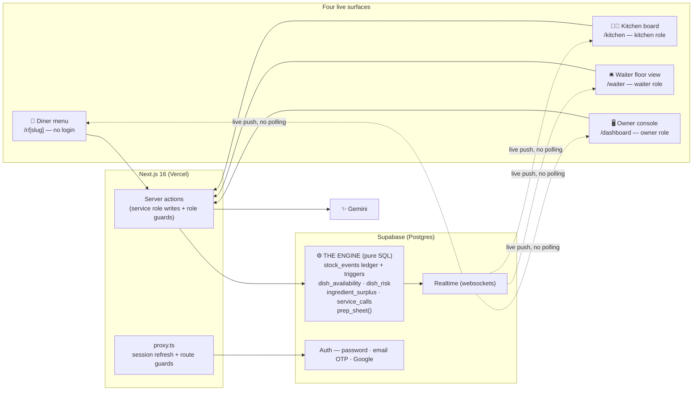
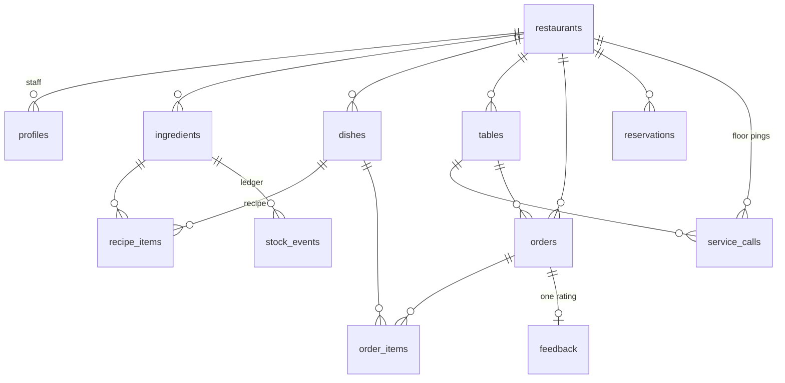

# 🏗️ Architecture & The Engine

EightySix is four live surfaces over one SQL engine. This is the technical deep dive: the shape of the system, the database that powers it, the security model, and the AI guardrails.

<p align="center">
  <a href="#system-overview">System</a> •
  <a href="#the-engine--pure-sql">Engine</a> •
  <a href="#database-schema">Schema</a> •
  <a href="#security-model">Security</a> •
  <a href="#ai-with-guardrails">AI</a> •
  <a href="#design-decisions">Decisions</a>
</p>

## System Overview



Three principles govern everything:

1. **The database is the only truth.** Availability, risk, forecasts and money are computed in Postgres. The UI renders rows; it never re-derives them.
2. **All writes cross the server.** Browser clients — anonymous diners *and* signed-in staff — are read-only by RLS. Every mutation is one of 24 server actions ([`src/app/actions.ts`](../src/app/actions.ts)) running with the service role.
3. **Nothing polls.** Every surface subscribes to Supabase Realtime; a single row change fans out to all four screens over websockets in the same second. (One deliberate exception: risk decays with *time*, not just events, so the radar also recomputes on a clock tick.)

The complete cascade for a single order — `placeOrder("Butter Paneer ×2")`:

```text
placeOrder validates against LIVE dish_availability, prices from DB rows
  └─ orders + order_items insert (service role)
       └─ trigger: one negative stock_events row per recipe ingredient
            └─ trigger: events fold into ingredients.stock_qty
                 └─ view: dish_availability recomputes portions_left
                      └─ view: dish_risk recomputes minutes_to_86
                           └─ Realtime pushes row changes
                                └─ kitchen ticket + chime · diner badges count down
                                   · radar re-ranks · banner recomputes
```

Steps inside Postgres happen via triggers — the application *cannot* forget to do them. And because dishes share ingredients, ordering Butter Paneer visibly shrinks Palak Paneer's badge too.

## The Engine — Pure SQL

The heart of the product lives in [`supabase/migrations/`](../supabase/migrations/), not in application code:

| File | Creates |
|---|---|
| `001_init.sql` | Schema, RLS, engine triggers, `dish_availability`, realtime publication, demo seed |
| `002_auth.sql` | Profile-on-signup trigger, `my_restaurant_id()`, staff write policies |
| `003_intelligence.sql` | `dish_risk` view, `prep_sheet()` forecaster |
| `004_reset.sql` | Stable-ID `reset_demo()` — clears history without killing logins/QRs/channels |
| `005_hospitality.sql` | Reservations, feedback, updated `reset_demo()` |
| `006_floor.sql` | Waiter role, `service_calls` (diner → floor pings), chef's specials (`regular_price` / `special_note` / `special_until` on dishes), `ingredient_surplus` view, `unit_price` snapshot trigger on `order_items`, radar edge-case fixes (`greatest(1, …)` ETA, `greatest(0, …)` portions) |
| `007_history.sql` | `seed_order_history()` — every reset seeds ~35 paid orders across the prior six IST days (depletion triggers suspended, so live stock stays at seed values) |
| `008_seed_extras.sql` | Richer reset seed: today's settled lunch, tonight's bookings, diner ratings on past orders — kitchen queue and service calls stay empty for the live demo — plus the final `reset_demo()` |

### The ledger and its triggers

Every stock change — an order, a manual 86-board tap, a prep restock — is an **immutable row in `stock_events`** (`delta` signed, `reason` ∈ `order`/`manual`/`prep`). Stock is never edited in place; the inventory page shows this ledger as a live audit trail.

- **`trg_deplete_stock`** (`AFTER INSERT ON order_items`) — ordering a dish *is* consuming its ingredients:

  ```sql
  insert into public.stock_events (ingredient_id, delta, reason)
  select r.ingredient_id, -(r.qty_per_portion * new.qty), 'order'
  from public.recipe_items r where r.dish_id = new.dish_id;
  ```

- **`trg_apply_stock_event`** (`AFTER INSERT ON stock_events`) — folds each event into `ingredients.stock_qty`, floored at zero.
- **`on_auth_user_created`** — creates a `profiles` row at signup with the role from metadata (`owner`/`kitchen`/`waiter`; Google OAuth defaults to `owner`). The client never writes its own role.
- **`trg_fill_order_item_price`** (`BEFORE INSERT ON order_items`) — freezes the dish's current price into `unit_price`, so bills and analytics total from what the diner actually saw, forever.

### The derived views

Both run with `security_invoker = on` (the caller's RLS applies).

- **`dish_availability`** — `portions_left = floor(min over recipe of (stock_qty ÷ qty_per_portion))`. A dish is exactly as available as its scarcest ingredient. No cache, no invalidation — a view can't be stale.
- **`dish_risk`** — extends availability with `velocity_30min` (portions ordered in the trailing 30 minutes, from real timestamps) and the live time-of-death: `minutes_to_86 = greatest(1, round(portions_left × 30 ÷ velocity_30min))` (`0` = dead, `NULL` = no velocity, not dying; the `greatest(1, …)` keeps a fast-selling last portion from collapsing onto the dead sentinel and vanishing off the radar at its most critical moment). The UI layers thresholds on top ([`src/lib/engine.ts`](../src/lib/engine.ts)): alerts at ≤ 45 min, radar horizon 8 h, "low" badge at ≤ 5 portions.

### The functions

- **`prep_sheet(rid)`** — tomorrow's forecast from the ledger: daily usage per ingredient (`reason = 'order'`), averaged by tomorrow's **day of week** (falling back to overall average), then `reorder_qty = max(0, predicted × 1.2 − stock)` priced by `cost_per_unit` → the draft purchase order, grouped by kitchen station.
- **`reset_demo()`** — restores the seed with **stable IDs**: clears order history/events/reservations, frees tables, restores exact seed stock via `UPDATE`, self-heals lost profiles. The v1 drop-and-reseed broke logins, printed QRs and realtime channels — `004_reset.sql` documents the fix. Execution is revoked from every client role (service-role only).
- **`my_restaurant_id()`** — the building block of every staff RLS policy.

### Verified math

> Seed: paneer = **9 kg**, Butter Paneer uses **0.2 kg/portion** → 45 portions.
> Order **×2** → ledger event −0.4 kg → 8.6 kg → `floor(8.6 ÷ 0.2)` = **43 portions**.
> At 6 portions/30 min velocity → `minutes_to_86 = round(43 × 30 ÷ 6)` = **215 min** — and the radar shows exactly that.

No mock data, no hardcoded countdowns: every number on screen derives from these rows.

## Database Schema



| Table | Key Columns | Notes |
|---|---|---|
| `restaurants` | `slug` (unique), `name`, `tagline` | Public menu URL is `/r/{slug}` |
| `profiles` | `id` = `auth.users.id`, `role` | `owner` \| `kitchen` \| `waiter`, CHECK-constrained, trigger-created |
| `ingredients` | `stock_qty`, `reorder_level`, `cost_per_unit`, `unit` | `stock_qty` is **never written by the app** — the ledger trigger owns it |
| `dishes` | `price`, `regular_price`, `special_note`, `special_until`, `category`, `veg`, `img`, `is_active` | `price` is the only price the server ever trusts; a running special *is* the price, with the original parked in `regular_price` — so no parallel price math exists anywhere |
| `recipe_items` | `(dish_id, ingredient_id)` PK, `qty_per_portion > 0` | The recipe graph — the edge weight everything derives from |
| `tables` | `label`, `seats`, `status` | `free` \| `occupied` |
| `orders` | `table_id`, `status`, `created_at` | `placed → cooking → served → paid` |
| `order_items` | `dish_id`, `qty > 0`, `unit_price`, `status`, `created_at` | Inserting here fires the depletion trigger **and** freezes `unit_price` — bills and analytics can't be rewritten by later price changes; timestamps feed velocity |
| `stock_events` | `delta` (signed), `reason`, `created_at` | The append-only ledger; `restaurant_id` backfilled by a BEFORE trigger |
| `reservations` | `party_size` 1–20, `reserved_at`, `status` | `booked → seated → completed` \| `cancelled` |
| `feedback` | `order_id` **UNIQUE**, `rating` 1–5 | One rating per order, enforced by the DB |
| `service_calls` | `table_id`, `kind` (`waiter` \| `bill`), `status` (`open` \| `done`) | Diner → floor pings; deduped per table+kind server-side; realtime-published to the waiter board |

Indexes back every hot path: orders/events by `(restaurant_id, created_at desc)`, order items by `(dish_id, created_at desc)` for the velocity window, the ledger by ingredient for the audit trail.

**Realtime:** `stock_events`, `orders`, `order_items`, `ingredients`, `dishes`, `tables`, `reservations`, `feedback` are all in the `supabase_realtime` publication.

## Security Model

Defense in depth — four independent layers, shaped by one constraint: **diners must stay fully anonymous** while money and stock stay tamper-proof.

| # | Layer | Where | Stops |
|---|---|---|---|
| 1 | Route guards + session refresh | [`src/proxy.ts`](../src/proxy.ts) | Unauthenticated navigation to `/dashboard/*`, `/kitchen/*`, `/waiter/*` (server-verified `getUser()`, redirect with `?next=`) |
| 2 | Per-request auth context | [`src/lib/owner.ts`](../src/lib/owner.ts) | A valid session on the wrong surface — pages re-verify role + restaurant before rendering |
| 3 | Per-action role guards | [`src/lib/authz.ts`](../src/lib/authz.ts) | Direct invocation of operational server actions without a staff session — every mutating action resolves the caller's role and validates ownership of client-supplied IDs before the service role writes; order statuses are forward-only |
| 4 | Server-action write path | [`src/app/actions.ts`](../src/app/actions.ts) | Tampered prices, stale-menu orders, forged mutations |
| 5 | Row Level Security | Postgres | Everything above failing — the database enforces the model itself |

**RLS on all 11 tables:** `public read` everywhere except `profiles` (own-row only); `staff update` scoped to `my_restaurant_id()`; `staff insert stock events` with `WITH CHECK` on the caller's restaurant. Notably **absent**: any anon `INSERT` policy — even if every app layer failed, an anonymous client could not write a row.

**Server-trusted money:** the cart sends dish IDs and quantities only. Prices come from `dishes.price` on the server; totals and GST (5% = 2.5% CGST + 2.5% SGST) are computed at billing time from rows; interventions and purchase orders are priced from `cost_per_unit`. `placeOrder` also re-validates against **live** availability at insert time — a diner holding a stale menu cannot order a dead dish.

**Secrets:** `SUPABASE_SERVICE_ROLE_KEY` and `GEMINI_API_KEY` are server-only; the Gemini wrapper and admin client import `"server-only"`, so a client-bundle import fails the build rather than leaking a key.

**The demo credentials are intentionally public** ([`src/lib/demo.ts`](../src/lib/demo.ts)) — one-click evaluator entry into a sandbox that holds no private data, is RLS-scoped to the demo restaurant, and resets itself.

## AI With Guardrails

Gemini (`gemini-flash-latest`, a ~40-line REST wrapper in [`src/lib/gemini.ts`](../src/lib/gemini.ts), temperature 0.4, strict JSON mode where structure matters) is used in four places, all following the same pattern:

```text
GROUND    prompt built exclusively from engine output (live availability,
          real ETAs, real ratings, real usage)
GENERATE  low temperature; JSON mode when the output must be structured
VALIDATE  picks checked against live database state before rendering
FALLBACK  Gemini down → a deterministic non-AI path still works
```

| Feature | Grounding & Guardrail |
|---|---|
| **Dead-dish swaps** (`suggestSwap`) | The *cause* is computed from the recipe graph first, no AI (*"kitchen ran out of paneer"*). Candidates = only dishes with `portions_left > 0`; the model's returned IDs are filtered against that map — an unavailable pick is silently dropped. Fallback: nearest same-category, same-veg dishes. |
| **Manager brief** (`getMorningBrief`) | Prompted with today's server-computed revenue, the at-risk list with real ETAs, dead dishes, and low ingredients. Gemini's job is strictly editorial: ≤ 4 terse, action-focused bullets. |
| **Chef's prep notes** (prep page) | `prep_sheet()` produces every number; the AI only writes the narrative around them, and the sheet renders fine without it. |
| **Feedback themes** (`getFeedbackSummary`) | Summarizes real ratings/comments; the raw feedback is always shown regardless. |
| **Special pitches** (`runSpecial`) | The engine picks the dish and computes the price cut deterministically; Gemini only writes the one-line pitch from those facts. Fallback: a plain "₹X off today" line. |

Every Gemini call is timeboxed at 8 seconds (`AbortSignal.timeout`) — a hung upstream fails fast into the deterministic fallback instead of stalling a server action.

What the AI is **never** allowed to do: report a number the engine didn't compute, suggest a dish without a live-stock check, decide the status banner (deterministic, from the radar), or touch money.

## Design Decisions

| Decision | Alternative Rejected | Why |
|---|---|---|
| Availability as a SQL view | App-layer computation + caching | A view can't be stale and can't disagree with the ledger; no invalidation bugs during a rush |
| Event-sourced stock ledger | `UPDATE stock SET qty = qty - x` | Free audit trail; usage history *is* the forecast input; idempotent resets |
| Service-role writes behind server actions | Client writes guarded by RLS `INSERT` policies | Money and availability validation must run on the server anyway; diners stay fully anonymous |
| Prediction = arithmetic (`portions ÷ velocity`) | ML forecasting | Deterministic, explainable to the minute, verifiable by hand — and honest about being so |
| Rush simulator uses the real order path | Scripted fake data | Demo integrity: judges watch the actual machine; every number is derived, not staged |
| Stable-ID `reset_demo()` | Drop-and-reseed | Reset without breaking logins, open realtime channels, or printed QR links |
